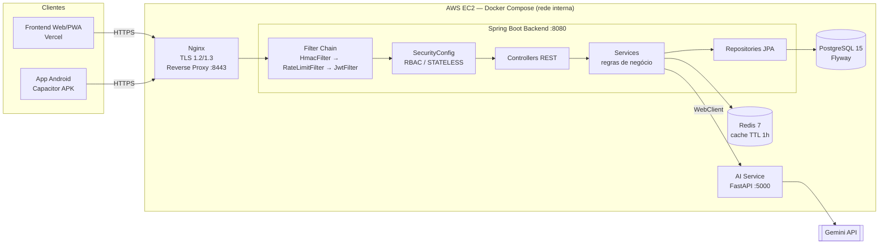
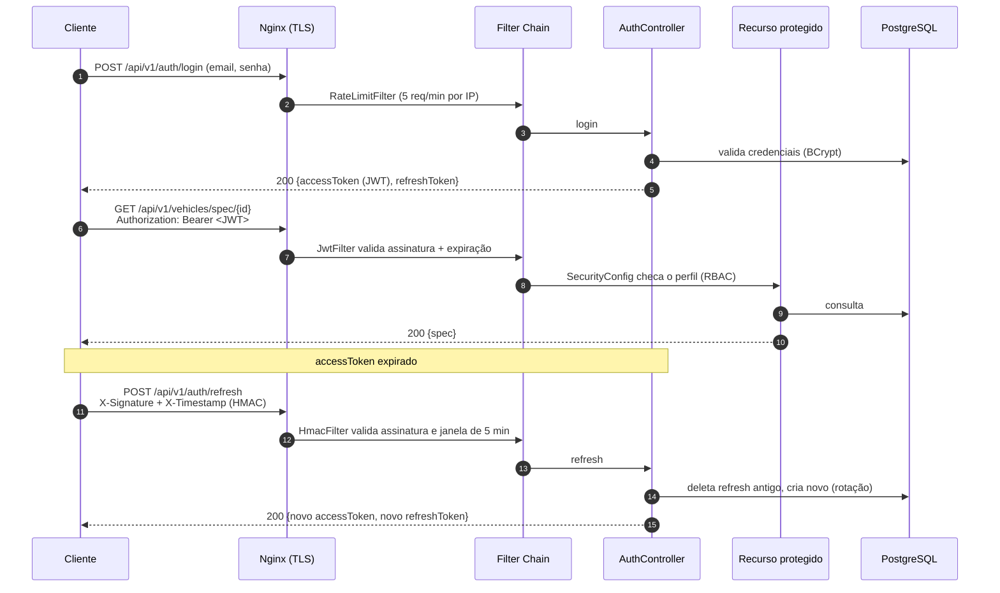

# AutoSpec Intelligence — Backend

> API RESTful de inteligência competitiva automotiva desenvolvida em **Java 17 + Spring Boot 3.4.1**, com autenticação JWT, RBAC, cache distribuído, geração de specs via IA e exportação em PDF.

**Projeto Ford Challenge FIAP 2026 — Desafio 01: Inteligência Competitiva Automotiva**
**Disciplina:** Arquitetura Orientada a Serviços e Web Services — **Sprint 3**

| Recurso | Link |
|---|---|
| 🌐 API em produção | `https://autospec.duckdns.org:8443` |
| 📖 Swagger UI | https://autospec.duckdns.org:8443/swagger-ui/index.html |
| 🖥️ Frontend (Web/PWA) | https://autospec-mobile.vercel.app |
| 📦 Repositório | https://github.com/Brunootavioliveira/autospec-intelligence-platform |
| ☁️ Infraestrutura | AWS EC2 t3.micro (Ubuntu) + Docker Compose |

---

## Como acessar a solução (LEIA PRIMEIRO)

A API em produção usa um **certificado TLS autoassinado** (projeto acadêmico, sem CA paga). Por isso, o navegador bloqueia as chamadas do frontend para a API até que o certificado seja aceito manualmente **uma vez**. Siga esta ordem:

1. **Abra o Swagger primeiro:**
   👉 https://autospec.duckdns.org:8443/swagger-ui/index.html
2. O navegador vai exibir um aviso de **"Sua conexão não é particular"** / **"Risco potencial de segurança"**.
3. Clique em **Avançado** → **Ir para autospec.duckdns.org (não seguro)** (no Firefox: *Avançado → Aceitar o risco e continuar*).
4. Confirme que a página do **Swagger UI carregou**. A partir daqui o navegador confia no certificado para esse host.
5. **Só então abra o frontend:**
   👉 https://autospec-mobile.vercel.app
6. Crie uma conta (ou faça login) e use o sistema normalmente.

> Se o frontend exibir erro de rede / "Failed to fetch" / não carregar dados, volte ao passo 1: o certificado ainda não foi aceito nesse navegador (ou a exceção expirou).
> No **APK Android**, se as chamadas falharem, abra antes o link do Swagger no navegador do próprio celular e aceite o risco.

### Usuários / perfis para teste

| Perfil | Como obter | Permissões |
|---|---|---|
| `VIEWER` | Criado automaticamente em `POST /api/v1/auth/register` | Somente leitura |
| `ANALYST` | Promovido por um ADMIN (`PATCH /api/v1/users/{id}/role`) | VIEWER + gerar spec com IA + relatórios |
| `ADMIN` | Promovido por outro ADMIN / definido direto no banco | ANALYST + deletar specs + gerir usuários |

> 📝 **Credenciais de teste (admin) para o professor:** 
*Email: testee@gmail.com*
*Senha: 12345678*

---

## Índice

- [Visão Geral](#visão-geral)
- [1. Arquitetura da Solução](#1-arquitetura-da-solução)
- [2. Autenticação e Autorização](#2-autenticação-e-autorização)
- [3. JWT](#3-jwt)
- [4. Maturidade REST — Nível 2](#4-maturidade-rest--nível-2)
- [5. Testes Automatizados](#5-testes-automatizados)
- [6. Documentação e Tratamento de Erros](#6-documentação-e-tratamento-de-erros)
- [Stack Tecnológica](#stack-tecnológica)
- [Estrutura de Pacotes](#estrutura-de-pacotes)
- [Módulos](#módulos)
- [Segurança adicional](#segurança-adicional)
- [Cache e Performance](#cache-e-performance)
- [Banco de Dados](#banco-de-dados)
- [Infraestrutura Docker](#infraestrutura-docker)
- [Variáveis de Ambiente](#variáveis-de-ambiente)
- [Como Rodar Localmente](#como-rodar-localmente)
- [Deploy na AWS EC2](#deploy-na-aws-ec2)
- [Endpoints da API](#endpoints-da-api)
- [Decisões Técnicas](#decisões-técnicas)
- [Autores](#autores)

---

## Visão Geral

O backend do AutoSpec Intelligence resolve o **Desafio 01 da Ford**: receber **marca, modelo, versão (e ano)** de um veículo concorrente e devolver uma **lista padronizada de especificações técnicas**, sempre no mesmo formato, com campos ausentes explicitados.

Ele orquestra:

- **Geração de specs via IA** — delega a um microserviço Python/FastAPI que usa o modelo Gemini
- **Cache inteligente** — Redis evita chamadas repetidas à IA
- **Comparação técnica** — score por atributo com vencedor calculado
- **Análise avançada** — power-to-weight, Track Handling Score e percentis
- **Relatórios em PDF** — Comparison Report e Vehicle Dossier
- **Garage pessoal** — frota do analista com insights e soft delete
- **Auditoria** — rastreamento de ações críticas (usuário + timestamp)

---

## 1. Arquitetura da Solução

### 1.1 Diagrama de componentes



### 1.2 Responsabilidades

| Componente | Responsabilidade |
|---|---|
| **Nginx** | Terminação TLS, redirect HTTP→HTTPS, reverse proxy. Único ponto exposto — o backend **não publica porta** externamente |
| **HmacFilter** | Assinatura HMAC-SHA256 + anti-replay (5 min) em endpoints críticos |
| **RateLimitFilter** | Limitação de taxa (Bucket4j) por IP ou usuário |
| **JwtFilter** | Extrai e valida o JWT, popula o `SecurityContext` |
| **SecurityConfig** | Regras de acesso por rota e por perfil (RBAC), sessão STATELESS |
| **Controllers** | Camada HTTP: validação de entrada, mapeamento de rotas e status codes |
| **Services** | Regras de negócio, cache, orquestração com o AI Service |
| **Repositories** | Acesso a dados (Spring Data JPA) |
| **MapStruct** | Conversão Entity ↔ DTO em tempo de compilação |
| **Redis** | Cache de specs já geradas |
| **PostgreSQL** | Persistência; schema versionado via Flyway |
| **AI Service** | Extração de specs técnicas via Gemini (microserviço separado) |
| **GlobalExceptionHandler** | Padronização de todas as respostas de erro |

### 1.3 Separação em camadas (por módulo de domínio)

```
Controller  →  Service  →  Repository  →  Banco
    │             │
    DTO (in/out)  Entity  (MapStruct entre elas)
```

Cada módulo (`auth`, `vehicle`, `garage`, ...) contém suas próprias camadas, mantendo alta coesão e baixo acoplamento.

### 1.4 Fluxo de comunicação e autenticação



Resumo textual do fluxo de uma requisição autenticada:

```
Cliente → Nginx (TLS) → HmacFilter → RateLimitFilter → JwtFilter
       → SecurityConfig (RBAC) → Controller → Service → Repository
       → PostgreSQL / Redis / AI Service
```

---

## 2. Autenticação e Autorização

### 2.1 Endpoints públicos × protegidos

| Tipo | Endpoints |
|---|---|
| **Públicos** | `POST /api/v1/auth/register`, `POST /api/v1/auth/login`, `POST /api/v1/auth/refresh` (exige HMAC), `POST /api/v1/auth/logout`, health check, Swagger UI / OpenAPI |
| **Protegidos (qualquer perfil autenticado)** | Consulta/busca/comparação de specs, análise, garage, histórico, comparações salvas, perfil (`/users/me`) |
| **Protegidos por perfil** | Geração de spec com IA e relatórios (ANALYST/ADMIN); deleção e gestão de usuários (ADMIN) |

### 2.2 Perfis e permissões (RBAC)

```java
// SecurityConfig
.requestMatchers(HttpMethod.DELETE, "/api/v1/**").hasRole("ADMIN")
.requestMatchers(HttpMethod.POST, "/api/v1/vehicles/**").hasAnyRole("ANALYST", "ADMIN")
.anyRequest().authenticated()
```

| Ação | VIEWER | ANALYST | ADMIN |
|---|:---:|:---:|:---:|
| Consultar / buscar specs | ✅ | ✅ | ✅ |
| Comparar e analisar | ✅ | ✅ | ✅ |
| Gerar spec com IA | ❌ | ✅ | ✅ |
| Gerar relatórios PDF | ❌ | ✅ | ✅ |
| Deletar specs | ❌ | ❌ | ✅ |
| Gerenciar usuários e roles | ❌ | ❌ | ✅ |

- Novos usuários entram como `VIEWER`.
- Um `ADMIN` promove usuários via `PATCH /api/v1/users/{id}/role`.
- Sem token → `401`. Token válido sem permissão → `403`.

### 2.3 Proteções complementares

- **Senhas:** BCrypt
- **Dados sensíveis em repouso:** `name` e `email` do usuário criptografados com **AES/GCM/NoPadding** (IV aleatório de 12 bytes por valor, tag de 128 bits)
- **Rate limit (Bucket4j):**

| Contexto | Chave | Limite |
|---|---|---|
| `POST /auth/login` | IP | 5 req/min |
| `POST /auth/refresh` | IP | 10 req/min |
| `/api/v1/vehicles/spec/**` | Usuário | 10 req/min |

- **HMAC-SHA256 + anti-replay:** `POST /auth/refresh` exige `X-Signature` = `HMAC(normalizedBody + timestamp, secret)` e `X-Timestamp`, com janela de 5 minutos
- **Sessões rastreadas:** `UserSession` guarda IP, browser, dispositivo e `lastActive`; o usuário pode revogar sessões

---

## 3. JWT

| Item | Implementação |
|---|---|
| Biblioteca | `jjwt 0.12.6` |
| Algoritmo | HMAC (chave secreta `JWT_SECRET`, mínimo 32 caracteres) |
| Geração | No login e no refresh (`JwtService`) |
| Validação | `JwtFilter` valida assinatura e expiração a cada requisição |
| Transporte | Header `Authorization: Bearer <token>` |
| Expiração do access token | `JWT_EXPIRATION` (padrão **24h**, em ms) |
| Refresh token | UUID persistido no banco, validade de **7 dias** |
| Rotação | A cada refresh o token antigo é deletado e um novo é emitido |
| Logout | Invalida o refresh token no banco |
| Proteção de recursos | O `JwtFilter` carrega o usuário e registra no `SecurityContextHolder`; o RBAC decide o acesso pelo papel do usuário |
| Sessão | `STATELESS` — nenhum estado de sessão no servidor |

Exemplo de uso:

```bash
# 1. Login
curl -k -X POST https://autospec.duckdns.org:8443/api/v1/auth/login \
  -H "Content-Type: application/json" \
  -d '{"email":"seu@email.com","password":"suasenha"}'

# 2. Chamar recurso protegido
curl -k https://autospec.duckdns.org:8443/api/v1/vehicles/spec \
  -H "Authorization: Bearer <accessToken>"
```

> `-k` é necessário apenas por causa do certificado autoassinado.

No Swagger: clique em **Authorize**, cole o `accessToken` (esquema `bearerAuth`) e teste os endpoints protegidos.

---

## 4. Maturidade REST — Nível 2

A API atende ao **Nível 2 do Modelo de Maturidade de Richardson**: recursos identificados por URI + uso correto dos verbos HTTP + status codes semânticos.

### 4.1 Orientação a recursos

Substantivos no plural, versionados em `/api/v1`, com hierarquia clara:

```
/api/v1/vehicles/spec          /api/v1/garage
/api/v1/analysis/{vehicleId}   /api/v1/history
/api/v1/comparisons/saved      /api/v1/reports
/api/v1/users                  /api/v1/auth
```

### 4.2 Uso dos métodos HTTP

| Método | Uso na API |
|---|---|
| `GET` | Leitura, listagem paginada, busca com filtros (idempotente, sem efeitos colaterais) |
| `POST` | Criação de recurso / geração de spec / login / geração de relatório |
| `PATCH` | Atualização parcial (perfil, nickname, fleet type, role) |
| `DELETE` | Remoção (hard delete de spec, soft delete em garage/histórico) |

### 4.3 Status codes

| Código | Quando |
|---|---|
| `200 OK` | Consulta/atualização com sucesso |
| `201 Created` | Recurso criado |
| `204 No Content` | Remoção com sucesso, sem corpo |
| `400 Bad Request` | Validação, JSON malformado, regra de negócio violada |
| `401 Unauthorized` | Sem token, token inválido/expirado ou credenciais incorretas |
| `403 Forbidden` | Autenticado, mas sem permissão para o recurso |
| `404 Not Found` | Recurso inexistente |
| `429 Too Many Requests` | Rate limit excedido |
| `500 Internal Server Error` | Falha inesperada (sem vazar detalhes internos) |

---

## 5. Testes Automatizados

### Como executar

```bash
cd backend
mvn test
# ou, com o wrapper:
./mvnw test
```

### Cenários cobertos

| Categoria | Cenário | Resultado esperado |
|---|---|---|
| ✅ Sucesso | Registro de usuário | `201` + tokens |
| ✅ Sucesso | Login com credenciais válidas | `200` + `accessToken` + `refreshToken` |
| ✅ Sucesso | `GET` de spec autenticado | `200` + spec |
| ✅ Sucesso | ANALYST gera spec | `200/201` |
| ❌ Erro | Login com senha incorreta | `401` |
| ❌ Erro | Corpo inválido / campo obrigatório ausente | `400` |
| ❌ Erro | Spec inexistente | `404` |
| 🔒 Não autorizado | Recurso protegido sem token | `401` |
| 🔒 Não autorizado | Token expirado/adulterado | `401` |
| 🔒 Não autorizado | VIEWER tenta gerar spec / ANALYST tenta deletar | `403` |
| 🔒 Não autorizado | Excesso de tentativas de login | `429` |

> 📝 **Ajustar esta tabela** para refletir exatamente as classes de teste existentes no projeto (`src/test/java/...`).

### Evidência de execução

> 📝 **Inserir aqui:** print do terminal com `mvn test` mostrando `Tests run: X, Failures: 0, Errors: 0` e/ou o relatório em `target/surefire-reports/`.

```
[INFO] Tests run: X, Failures: 0, Errors: 0, Skipped: 0
[INFO] BUILD SUCCESS
```

---

## 6. Documentação e Tratamento de Erros

### 6.1 Documentação da API (OpenAPI / Swagger)

- **springdoc-openapi 2.8.6**
- Swagger UI: https://autospec.duckdns.org:8443/swagger-ui/index.html
- Contrato OpenAPI (JSON): `https://autospec.duckdns.org:8443/v3/api-docs`
- Esquema de segurança `bearerAuth` configurado (botão **Authorize**)

### 6.2 Padronização das respostas de erro

Todo erro é tratado pelo `GlobalExceptionHandler` (`@RestControllerAdvice`) e devolvido no mesmo formato (`ErrorResponseDTO`), sem vazar stack trace ou detalhes internos:

| Exceção | HTTP | Mensagem ao cliente |
|---|---|---|
| `ResourceNotFoundException` | 404 | Mensagem do domínio |
| `BusinessException` | 400 | Mensagem do domínio |
| `MethodArgumentNotValidException` | 400 | `campo: mensagem` por campo |
| `IllegalArgumentException` | 400 | Mensagem do domínio |
| `HttpMessageNotReadableException` | 400 | "JSON malformado" |
| `AuthenticationException` | 401 | "Invalid email or password" |
| `AccessDeniedException` | 403 | "Acesso negado" |
| Rate limit excedido | 429 | JSON padronizado |
| `CryptoException` | 500 | "Erro interno de processamento" |
| `Exception` (genérica) | 500 | "Erro interno." |

### 6.3 README

Este documento contém as instruções de acesso e de execução (seções [Como acessar](#️-como-acessar-a-solução-leia-primeiro), [Como Rodar Localmente](#como-rodar-localmente) e [Deploy na AWS EC2](#deploy-na-aws-ec2)).

---

## Stack Tecnológica

| Camada | Tecnologia | Versão |
|---|---|---|
| Linguagem | Java | 17 |
| Framework | Spring Boot | 3.4.1 |
| Segurança | Spring Security | 6.4.2 |
| Persistência | Spring Data JPA + Hibernate | 6.6 |
| Banco | PostgreSQL | 15 |
| Cache | Redis + Spring Cache | 7-alpine |
| Migrations | Flyway | 10.x |
| Mapeamento | MapStruct | 1.5.5 |
| JWT | jjwt | 0.12.6 |
| Rate Limiting | Bucket4j | 8.10.1 |
| PDF | OpenPDF | 2.0.3 |
| HTTP Client | WebClient (WebFlux) | — |
| Documentação | springdoc-openapi | 2.8.6 |
| Boilerplate | Lombok | — |
| Build | Maven | 3.x |
| Runtime | Docker + Nginx | — |
| Cloud | AWS EC2 t3.micro | Ubuntu |

---

## Estrutura de Pacotes

```
br.com.autospec.backend
│
├── BackendApplication.java           (@EnableCaching + @EnableJpaAuditing + @EnableScheduling)
│
├── config/
│   ├── AppConfig.java                (WebClient com timeout de 10s)
│   ├── AuditorAwareImpl.java         (createdBy/modifiedBy via SecurityContext)
│   ├── CorsConfig.java               (origens permitidas, sem wildcard)
│   └── OpenApiConfig.java            (Swagger bearerAuth)
│
├── core/
│   ├── common/                       (Auditable, DataRetentionJob, ErrorResponseDTO)
│   ├── exception/                    (BusinessException, CryptoException, ResourceNotFoundException)
│   ├── handler/                      (GlobalExceptionHandler)
│   ├── hmac/                         (HmacFilter, HmacUtil)
│   ├── http/                         (CachedBodyRequestWrapper)
│   └── security/                     (AuthConfig, CryptoConverter, PasswordConfig, SecurityConfig)
│
├── infrastructure/
│   └── HealthCheckController.java
│
└── modules/
    ├── analysis/     ├── auth/        ├── comparison/   ├── garage/
    ├── history/      ├── report/      ├── user/         └── vehicle/
```

---

## Módulos

| Módulo | Função |
|---|---|
| **Auth** | Registro (role `VIEWER`), login, refresh com rotação, logout. Entidades: `User`, `RefreshToken`, `UserSession` |
| **Vehicle** | Geração de spec via IA (Redis → PostgreSQL → AI Service), busca com filtros (brand, minYear, maxYear, minHp, maxHp), comparação por ID ou por spec |
| **Analysis** | Power-to-Weight (kg/kW), Track Handling Score e percentis populacionais |
| **Garage** | Frota `PERSONAL`/`WORK`, nickname, insights, soft delete |
| **History** | Auditoria de ações (`ANALYSIS`, `COMPARISON`, `SERVICE_RECORD`), filtro por tipo, paginação, soft delete |
| **Comparison** | Comparações salvas com título customizado |
| **Report** | PDFs (Comparison Report / Vehicle Dossier), whitelist de parâmetros, expiram após 1º download |
| **User** | Perfil, senha, sessões ativas e revogação, gestão de roles (ADMIN) |

---

## Segurança adicional

- **Criptografia em repouso** (AES-256-GCM) em campos sensíveis
- **CORS** restrito à origem do frontend (`FRONTEND_URL`), sem wildcard
- **TLS 1.2/1.3** apenas, com redirect HTTP→HTTPS
- **Backend sem porta exposta** — acessível só pela rede interna Docker via Nginx
- **Whitelist** de parâmetros no gerador de relatórios
- **Retenção de dados** (`DataRetentionJob`, todo domingo 00:00): remove specs com mais de 6 meses

---

## Cache e Performance

```java
@Cacheable(value = "vehicle-specs-by-key",
    key = "#request.brand() + '-' + #request.model() + '-' + #request.version() + '-' + #request.year()")
public VehicleResponseDTO generateVehicleSpec(VehicleRequestDTO request) { ... }

@Cacheable(value = "vehicle-specs-by-id", key = "#id")
public VehicleResponseDTO findById(Long id) { ... }

@CacheEvict(value = "vehicle-specs-by-id", key = "#id")
public void delete(Long id) { ... }
```

TTL: **1 hora**. Fluxo de geração:

```
POST /vehicles/spec
  ├─▶ Redis?      → retorna imediatamente
  ├─▶ PostgreSQL? → salva no Redis + retorna
  └─▶ AI Service  → salva no PG → salva no Redis → retorna
```

---

## Banco de Dados

```
users              id, name (AES-GCM), email (unique), password (BCrypt), role + Auditable
vehicle_specs      id, brand, model, version, year (unique: brand+model+version+year),
                   engine, horsepower, torque, drivetrain, topSpeed, acceleration,
                   length, width, height, weight, electricRange, price + Auditable
refresh_tokens     id, token (UUID), user_id, expiresAt
user_sessions      id, user_id, sessionToken, deviceInfo, ipAddress, browserApp, lastActive, active
garage_vehicles    id, user_id, vehicle_spec_id, fleetType, nickname, active + Auditable
user_history       id, user_id, actionType, title, description, referenceId, deleted
saved_comparisons  id, user_id, vehicle_a_id, vehicle_b_id, title + Auditable
```

Schema versionado com **Flyway** em produção (`ddl-auto: validate`). Auditoria via **JPA Auditing** (`createdBy`, `createdAt`, `lastModifiedBy`, `lastModifiedDate`).

---

## Infraestrutura Docker

```yaml
services:
  nginx:      # TLS 1.2/1.3, redirect HTTP→HTTPS, reverse proxy
  backend:    # Spring Boot, 512MB max, logs rotacionados (10MB x 3)
  ai-service: # FastAPI/Python, 512MB max, Gemini API
  postgres:   # PostgreSQL 15, volume persistente
  redis:      # Redis 7 Alpine, cache TTL 1h
```

Backend otimizado para t3.micro: `JAVA_OPTS: "-Xmx384m -Xms256m"`, `SPRING_PROFILES_ACTIVE: prod`.

---

## Variáveis de Ambiente

`infra/docker/.env`:

```env
# PostgreSQL
POSTGRES_DB=autospec_db
POSTGRES_USER=postgres
POSTGRES_PASSWORD=senha-forte-aqui

# JWT
JWT_SECRET=chave-minimo-32-caracteres-aqui
JWT_EXPIRATION=86400000        # 24 horas em ms

# HMAC (deve ser igual ao VITE_HMAC_SECRET do frontend)
HMAC_SECRET=chave-hmac-aqui

# Criptografia AES-GCM (exatamente 32 bytes)
DB_CRYPTO_KEY=chave-32-bytes-exata-aqui

# CORS
FRONTEND_URL=https://autospec-mobile.vercel.app
```

---

## Como Rodar Localmente

**Pré-requisitos:** Java 17+, Maven 3.8+, Docker e Docker Compose.

```bash
# 1. Clonar
git clone https://github.com/Brunootavioliveira/autospec-intelligence-platform.git
cd autospec-intelligence-platform

# 2. Variáveis de ambiente
cp infra/docker/.env.example infra/docker/.env
# edite com seus valores

# 3. Certificados SSL (autoassinados)
mkdir -p infra/docker/nginx/certs
openssl req -x509 -nodes -days 365 -newkey rsa:2048 \
  -keyout infra/docker/nginx/certs/key.pem \
  -out infra/docker/nginx/certs/cert.pem \
  -subj "/CN=localhost"

# 4. Infraestrutura de apoio
cd infra/docker
docker compose up -d postgres redis ai-service nginx
```

Crie o `application-dev.yaml`:

```yaml
spring:
  jpa:
    hibernate:
      ddl-auto: update
    show-sql: true
  flyway:
    enabled: false
```

```bash
# 5. Rodar o backend (perfil dev, porta 8080) na IDE ou:
cd backend
mvn spring-boot:run -Dspring-boot.run.profiles=dev
```

Acesse: `https://localhost:8443/swagger-ui/index.html` (aceite o aviso do certificado local, como descrito no topo).

---

## Deploy na AWS EC2

```bash
ssh -i ~/.ssh/autospec-key.pem ubuntu@SEU_IP

sudo apt update && sudo apt install -y docker.io docker-compose-plugin
sudo usermod -aG docker ubuntu   # reconecte o SSH

git clone https://github.com/Brunootavioliveira/autospec-intelligence-platform.git
cd autospec-intelligence-platform/infra/docker
nano .env

mkdir -p nginx/certs
openssl req -x509 -nodes -days 365 -newkey rsa:2048 \
  -keyout nginx/certs/key.pem -out nginx/certs/cert.pem -subj "/CN=SEU_DOMINIO_OU_IP"

sudo docker compose up -d --build
sudo docker ps
```

Comandos úteis:

```bash
sudo docker logs autospec-backend -f                 # logs em tempo real
sudo docker compose up -d --build backend            # rebuild só do backend
sudo docker exec -it autospec-postgres psql -U postgres -d autospec_db
sudo docker stats --no-stream                        # uso de memória
```

---

## Endpoints da API

Documentação interativa completa no [Swagger](https://autospec.duckdns.org:8443/swagger-ui/index.html).

### Authentication — `/api/v1/auth`

| Método | Rota | Auth | HMAC | Descrição |
|---|---|:---:|:---:|---|
| POST | `/register` | ❌ | ❌ | Criar conta (role padrão: VIEWER) |
| POST | `/login` | ❌ | ❌ | Login — retorna accessToken + refreshToken |
| POST | `/refresh` | ❌ | ✅ | Renovar tokens (rotação automática) |
| POST | `/logout` | ❌ | ❌ | Invalidar refresh token |

### Vehicle Specs — `/api/v1/vehicles/spec`

| Método | Rota | Role | HMAC | Descrição |
|---|---|:---:|:---:|---|
| POST | `/` | ANALYST, ADMIN | ✅ | Gerar spec com IA |
| GET | `/` | Todos | ❌ | Listar paginado |
| GET | `/{id}` | Todos | ❌ | Buscar por ID |
| GET | `/search` | Todos | ❌ | Busca textual + filtros |
| GET | `/compare` | Todos | ❌ | Comparar por IDs |
| POST | `/compare` | Todos | ❌ | Comparar por spec |
| DELETE | `/{id}` | ADMIN | ❌ | Deletar |

### Analysis — `/api/v1/analysis`

| Método | Rota | Descrição |
|---|---|---|
| GET | `/{vehicleId}` | Power-to-weight, Track Handling Score, percentis |

### Garage — `/api/v1/garage`

| Método | Rota | Descrição |
|---|---|---|
| POST | `/` | Adicionar veículo à frota |
| GET | `/` | Listar frota ativa |
| GET | `/fleet/{fleetType}` | Filtrar por PERSONAL ou WORK |
| GET | `/insights` | Total, mais potente |
| PATCH | `/{id}` | Atualizar fleet type ou nickname |
| DELETE | `/{id}` | Soft delete |

### History — `/api/v1/history`

| Método | Rota | Descrição |
|---|---|---|
| GET | `/` | Histórico paginado com filtro por tipo |
| DELETE | `/{id}` | Soft delete de entrada |
| DELETE | `/` | Limpar tudo |

### Saved Comparisons — `/api/v1/comparisons/saved`

| Método | Rota | Descrição |
|---|---|---|
| POST | `/` | Salvar comparação |
| GET | `/` | Listar paginado |
| DELETE | `/{id}` | Remover |

### Reports — `/api/v1/reports`

| Método | Rota | Descrição |
|---|---|---|
| POST | `/comparison` | Gerar Comparison Report PDF |
| POST | `/dossier` | Gerar Vehicle Dossier PDF |
| GET | `/{reportId}/download` | Download do PDF (expira após 1 uso) |

### Users — `/api/v1/users`

| Método | Rota | Descrição |
|---|---|---|
| GET | `/me` | Perfil do usuário |
| PATCH | `/me` | Atualizar nome |
| PATCH | `/me/password` | Alterar senha |
| GET | `/me/sessions` | Sessões ativas |
| DELETE | `/me/sessions/{id}` | Revogar sessão |
| DELETE | `/me/sessions` | Revogar todas as outras |
| GET | `/` | Listar todos (ADMIN) |
| PATCH | `/{id}/role` | Alterar role (ADMIN) |

---

## Decisões Técnicas

- **Arquitetura modular por domínio** em vez de pastas por camada: melhor coesão e evolução independente
- **STATELESS + JWT**: permite escalar horizontalmente sem sincronizar sessão
- **WebClient** (WebFlux) para o AI Service, com timeout de 10s
- **MapStruct**: mapeamento gerado em compilação, sem reflexão em runtime
- **Soft delete** em Garage e History: preserva histórico para auditoria
- **Microserviço de IA separado**: isola a dependência do Gemini e permite evoluir/substituir o modelo sem tocar no backend
- **Cache Redis**: reduz custo e latência de chamadas à IA

---

## Autores

Projeto acadêmico — **Ford Challenge FIAP 2026** — Engenharia de Software.

| Nome | RM |
|---|---|
| Bruno Otavio Silva De Oliveira | RM556196 |
| Guilherme Flores Pereira de Almeida | RM554948 |
| Luiz Fernando de Aragão Souza | RM555561 |
| Marcello de Freitas Moreira | RM557531 |
| Leonardo Gonçalves Novaes | RM554807 |

---

*AutoSpec Intelligence Backend — Java 17 + Spring Boot 3.4.1 + AWS EC2*
